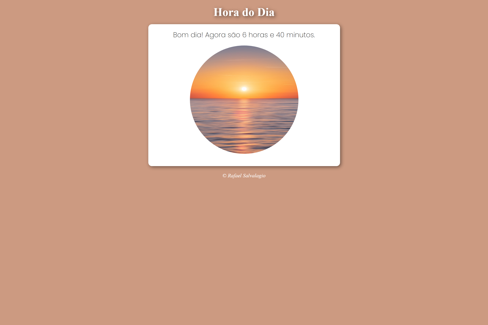
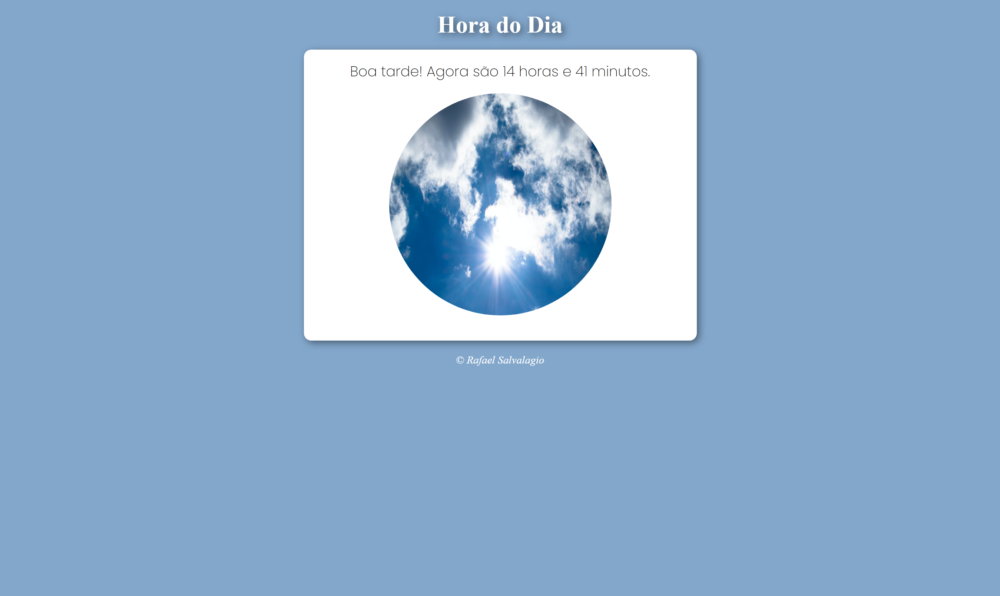
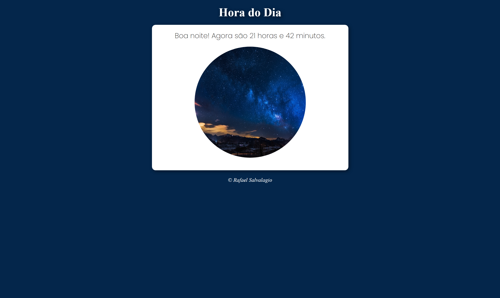

# Hora-do-Dia

Primeiro projeto feito com Javascript, onde modifico a imagem e cor de fundo do site conforme hora atual, usando conceitos como:
- new Date(), getHours() e getMinutes().
* Controlar o estilo do site usando o DOM.

## 🚀 Demonstração
## Manhã

## Tarde

## Noite

[Clique aqui](https://rafaelrfls.github.io/hora-do-dia/) para acessar o resultado final do projeto.

## 🛠️ Tecnologias Utilizadas

* [HTML](https://www.w3.org/html/) - Linguagem de Marcação
* [CSS](https://www.w3.org/Style/CSS/) - Linguagem de Estilização
* [JavaScript](https://www.javascript.com/) - JavaScript

<h2>📦 Temas abordados</h2>

- Fundamentos do CSS
- Alterações condicionais com JavaScript

## ✒️ Autor

    
    
&nbsp&nbsp&nbspRafael Salvalagio Ghensev 
    &nbsp&nbsp&nbsp<a href="https://github.com/rafaelrfls">GitHub</a>&nbsp;|&nbsp;<a href="https://www.linkedin.com/in/rafael-salvalagio-ghensev-49671285/">LinkedIn</a>&nbsp;

